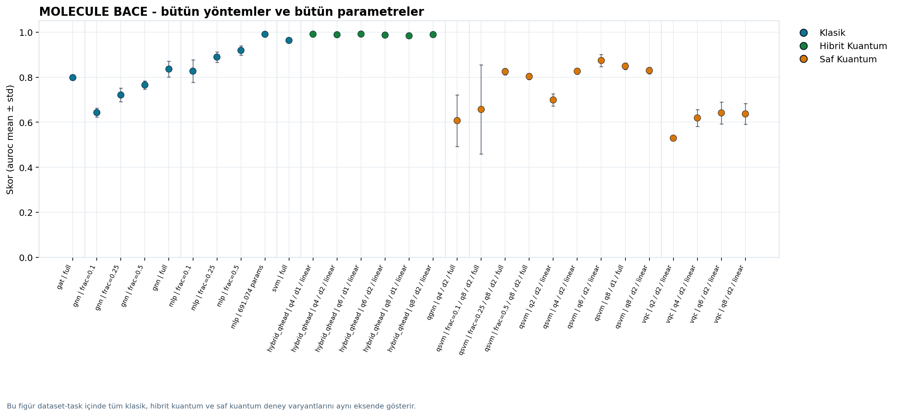
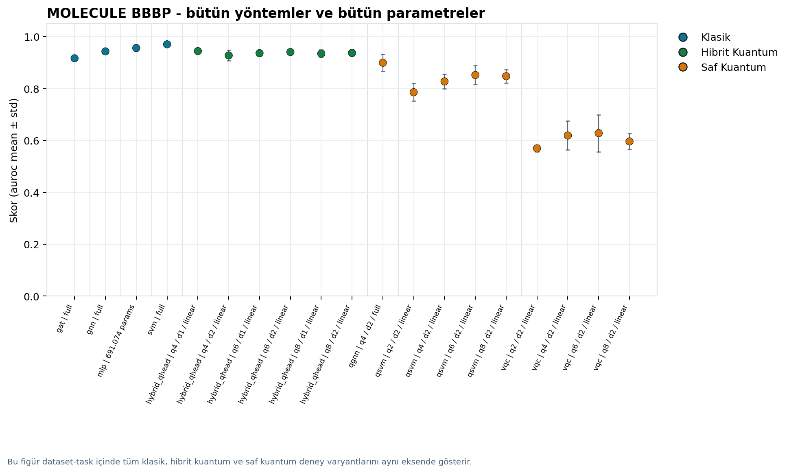
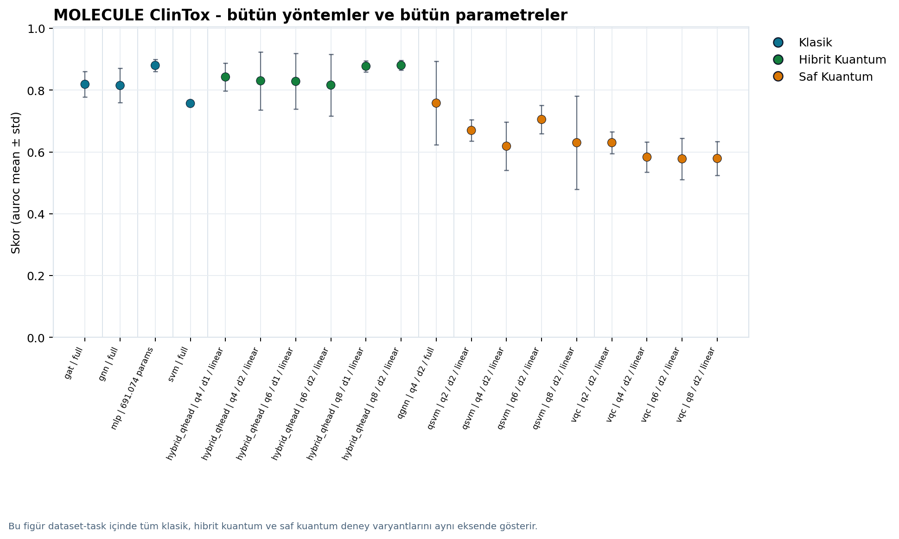

# MEDİKAL VERİ ANALİZİNDE KLASİK VE KUANTUM MAKİNE ÖĞRENMESİ MODELLERİNİN İNCELENMESİ

**Author:** Şahin Atakan Emre

**Repository:** QML Molecular Property Benchmark

Klasik makine öğrenmesi, saf kuantum makine öğrenmesi ve hibrit kuantum-klasik modellerin ilaç adaylarına ait moleküler veriler üzerinde karşılaştırmalı değerlendirmesi.

Bu çalışma BACE, BBBP ve ClinTox veri setlerinde moleküler özellik tahmini problemine odaklanır. Amaç, güçlü klasik taban modeller ile kuantum ve hibrit kuantum yaklaşımlarını aynı veri ayrımları, aynı seed politikası ve aynı metrik ailesi altında değerlendirmektir.

## GitHub Pages Seminer Sayfası

Yayın adresi:

[https://atakan-emre.github.io/Qml-molecular-property-benchmark/](https://atakan-emre.github.io/Qml-molecular-property-benchmark/)

Seminer sayfası `frontend/` klasöründeki statik dosyalardan oluşur. Sayfa tek ekranda pazarlama metni sunmak yerine doğrudan seminer anlatımını verir: veri setleri, SMILES/ECFP/graf/kubit temsil akışı, klasik modeller, kuantum kavramları, model mimarileri, CSV tabanlı bulgular, hibrit ablasyonlar, seed kararlılığı ve kanıt galerisi aynı tek sayfa içinde okunur.

Sayfa Türkçe ve İngilizce çalışır. Üst sağdaki dil seçimi ile akademik Türkçe ve akademik İngilizce metinler dinamik olarak değiştirilir. Görseller JavaScript canvas tabanlıdır; bit-kubit anlatımı, veri temsili, deney matrisi, kubit-derinlik kapasitesi ve seed dağılımı tarayıcı içinde üretilir.

GitHub Pages yayını `.github/workflows/deploy-pages.yml` ile yapılır. `main` veya `master` branch'e push geldiğinde workflow `frontend/` klasörünü GitHub Pages artifact olarak yükler ve deploy eder. Repository ayarlarında **Settings > Pages > Source** değeri **GitHub Actions** seçili olmalıdır.

## Tez Başlığı

**MEDİKAL VERİ ANALİZİNDE KLASİK VE KUANTUM MAKİNE ÖĞRENMESİ MODELLERİNİN İNCELENMESİ**

Kısa başlık önerisi:

**Kuantum Makine Öğrenmesi ile Moleküler Özellik Tahmini**

## Araştırma Soruları

1. Klasik descriptor ve grafik tabanlı modeller, moleküler özellik tahmini için ne kadar güçlü bir temel karşılaştırma sağlar?
2. QSVM, VQC ve QGNN modelleri klasik yaklaşımlara göre hangi koşullarda rekabetçi sonuç verebilir?
3. Donmuş klasik encoder üzerine kurulan kuantum başlık mimarisi, saf kuantum modellere göre daha kararlı ve uygulanabilir bir hibrit yaklaşım sunar mı?

## Veri Setleri

| Veri seti | Görev | Train | Validation | Test | Not |
|---|---|---:|---:|---:|---|
| BACE | BACE-1 inhibitör sınıflandırması | 1211 | 151 | 152 | Dengeliye yakın ikili sınıflandırma |
| BBBP | Kan-beyin bariyeri geçiş tahmini | 1631 | 204 | 204 | Pozitif sınıf baskın |
| ClinTox | Klinik toksisite tahmini | 1184 | 148 | 148 | Belirgin sınıf dengesizliği |

Veriler MoleculeNet kaynaklıdır. SMILES temsilleri RDKit ile işlenmiş, ECFP parmak izleri ve moleküler grafik temsilleri üretilmiştir. Aktif veri konumu:

```text
data/processed/{bace,bbbp,clintox}/{train,val,test}/
```

## Model Aileleri

| Grup | Modeller | Temsil | Rol |
|---|---|---|---|
| Klasik descriptor | SVM, MLP | ECFP | Güçlü klasik baseline |
| Klasik grafik | GNN, GAT | Moleküler grafik | Grafik tabanlı öğrenme |
| Saf kuantum descriptor | QSVM, VQC | ECFP + PCA + kuantum devre | Kuantum feature map ve ansatz etkisi |
| Kuantum grafik | QGNN | Moleküler grafik | Kuantum mesaj geçirme yaklaşımı |
| Hibrit kuantum-klasik | Frozen MLP encoder + quantum head | ECFP embedding | Tezin ana hibrit yaklaşımı |

## Öne Çıkan Bulgular

Ana karşılaştırma metriği AUROC'tur. ClinTox gibi dengesiz veri setlerinde AUROC; PR-AUC, F1, MCC, sensitivity ve specificity ile birlikte yorumlanmalıdır.

| Veri seti | En güçlü klasik sonuç | En güçlü hibrit sonuç | Saf kuantumda öne çıkan sonuç |
|---|---:|---:|---:|
| BACE | MLP: 0.9905 | Hybrid QHead q6-d1: 0.9914 | QSVM q6: 0.8741 |
| BBBP | SVM: 0.9706 | Hybrid QHead q4-d1: 0.9444 | QGNN: 0.8995 |
| ClinTox | MLP: 0.8802 | Hybrid QHead q8-d2: 0.8804 | QGNN: 0.7582 |

Genel gözlem: klasik descriptor modeller hâlâ çok güçlüdür. Buna karşın hibrit kuantum başlık mimarisi BACE ve ClinTox üzerinde klasik performans seviyesine yaklaşabilmiştir. Saf kuantum descriptor modeller arasında QSVM, VQC'ye göre daha kararlı sonuç vermiştir.

## Repo Yapısı

```text
Qml-molecular-property-benchmark/
├── README.md
├── requirements.txt
├── LICENSE
├── .gitattributes
├── .github/
│   └── workflows/
│       └── deploy-pages.yml
├── frontend/
│   ├── index.html
│   ├── styles.css
│   ├── script.js
│   ├── data/
│   └── assets/
├── docs/
│   └── molecular_report_tr.md
├── source/
│   ├── molecule/
│   │   ├── classical/
│   │   ├── quantum/
│   │   ├── configs/
│   │   └── data/
│   └── shared/
├── data/
│   ├── README.md
│   └── processed/
│       ├── bace/
│       ├── bbbp/
│       └── clintox/
├── results/
│   ├── README.md
│   ├── analysis/
│   └── tables/
└── provenance/
    ├── README.md
    └── MANIFEST.md
```

Yerel doğrulama amacıyla tutulan ağır eğitim çıktıları `results/checkpoints/`, `results/logs/` ve `results/figures/` altında kalır. Bu klasörler silinmemiştir; Git geçmişini büyütmemek için `.gitignore` kapsamındadır.

`thesis/` klasörü yerel seminer/tez çalışma alanı olarak korunur ve GitHub'a aktarılmaması için `.gitignore` içindedir.

## Kurulum

Windows PowerShell örneği:

```powershell
cd E:\molecular
python -m venv .venv
.\.venv\Scripts\Activate.ps1
pip install -r requirements.txt
```

Kodları doğrudan `source/` altından çalıştırmak için:

```powershell
$env:PYTHONPATH = (Resolve-Path .\source).Path
$env:MOLECULAR_RESULTS_DIR = (Resolve-Path .\results_runtime).Path
$env:MOLECULAR_OUTPUT_DIR = (Resolve-Path .\outputs_runtime).Path
New-Item -ItemType Directory -Force .\results_runtime, .\outputs_runtime | Out-Null
```

Hazır tez çıktıları `results/analysis/` ve `results/tables/` altında tutulur. Yeni denemeler varsayılan olarak `results_runtime/` ve `outputs_runtime/` altında üretilir.

## Veri Hazırlama

Veriler hazır olarak `data/processed/` içinde bulunur. Yeniden üretmek için:

```powershell
python source\molecule\data\download_moldata.py `
  --data-dir data\processed `
  --datasets bace bbbp clintox `
  --generate-ecfp `
  --generate-rdkit
```

Her split için temel dosyalar:

- `data.csv`: SMILES ve etiket bilgisi
- `ecfp_r2_b1024.npy`: ECFP parmak izi
- `X.npy`: model girdisi
- `y.npy`: etiket
- `valid_mask.npy`: geçerli SMILES maskesi

## Deney Komutları

Klasik descriptor modeller:

```powershell
python source\molecule\classical\train_descriptor.py `
  --model mlp `
  --dataset bace `
  --data-dir data\processed `
  --seeds 0 42 123 456 789
```

Klasik grafik modeller:

```powershell
python source\molecule\classical\train_graph.py `
  --model gnn `
  --dataset clintox `
  --data-dir data\processed `
  --seeds 0 42 123 456 789
```

QSVM:

```powershell
python source\molecule\quantum\descriptor\train_qsvm.py `
  --dataset bace `
  --data-dir data\processed `
  --n-qubits 6 `
  --circuit-depth 2 `
  --entanglement linear `
  --seeds 0 42 123 456 789
```

VQC:

```powershell
python source\molecule\quantum\descriptor\train_vqc.py `
  --dataset bace `
  --data-dir data\processed `
  --n-qubits 4 `
  --circuit-depth 2 `
  --maxiter 200 `
  --seeds 0 42 123 456 789
```

QGNN:

```powershell
python source\molecule\quantum\graph\train_qgnn.py `
  --dataset bbbp `
  --data-dir data\processed `
  --n-qubits 4 `
  --circuit-depth 2 `
  --seeds 0 42 123 456 789
```

Hibrit kuantum başlık:

```powershell
python source\molecule\quantum\descriptor\train_hybrid_qhead.py `
  --dataset bace `
  --data-dir data\processed `
  --n-qubits 6 `
  --circuit-depth 1 `
  --seeds 0 42 123 456 789
```

Hibrit model, önce eğitilmiş klasik MLP encoder checkpoint'ini kullanır. Bu nedenle ilgili MLP deneyinin daha önce çalıştırılmış olması gerekir.

## Metrikler

Projede kullanılan temel metrikler:

- AUROC
- PR-AUC
- Accuracy
- Balanced Accuracy
- F1
- Precision
- Recall
- MCC
- Sensitivity
- Specificity
- ECE
- Eğitim ve çıkarım süresi

## Sonuç Dosyaları

Ana analiz dosyaları:

- `results/analysis/molecular_benchmark_summary.csv`
- `results/analysis/molecular_leaderboard.csv`
- `results/analysis/molecular_inventory.json`

Deney metrikleri:

- `results/tables/*_aggregated.json`
- `results/tables/*_results.json`

Tez ve makale için seçilmiş figürler:

- `results/analysis/paper_figures/`
- `results/analysis/figures/`

Öne çıkan karşılaştırma görselleri:







## Dokümantasyon

- [Moleküler deney raporu](docs/molecular_report_tr.md)

## Tekrar Üretilebilirlik

Ana deneylerde kullanılan seed seti:

```text
0, 42, 123, 456, 789
```

Deneyler ortalama ve standart sapma ile raporlanır. Tek bir seed sonucuna dayalı yorum yapılmamalıdır. Dengesiz veri setlerinde özellikle ClinTox için accuracy tek başına yeterli değildir; AUROC, PR-AUC, F1, MCC, sensitivity ve specificity birlikte değerlendirilmelidir.

## Lisans ve Atıf

Kod MIT lisansı ile paylaşılır. Veri setleri MoleculeNet/DeepChem kaynaklıdır ve kendi lisans/atıf koşullarına tabidir. Tez veya makale yazımında MoleculeNet, RDKit, PyTorch, PyTorch Geometric, Qiskit, PennyLane ve kullanılan model ailelerinin özgün yayınlarına atıf verilmelidir.
